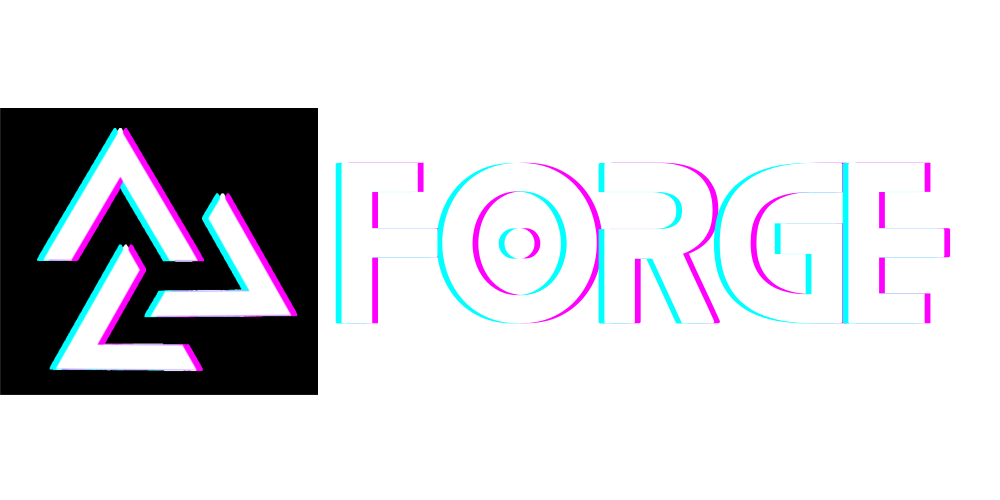
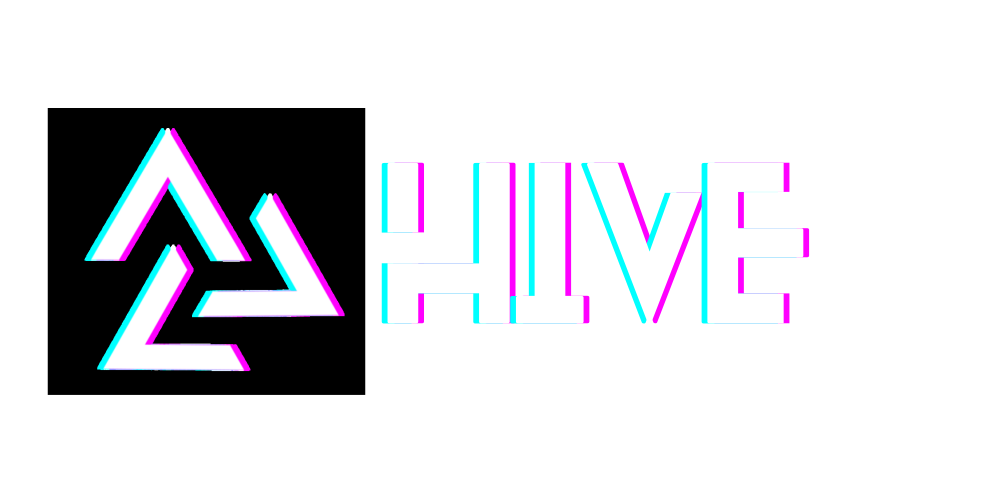
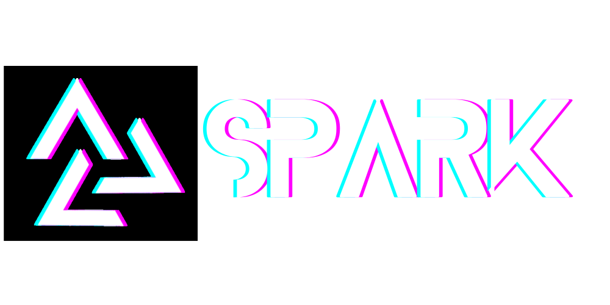
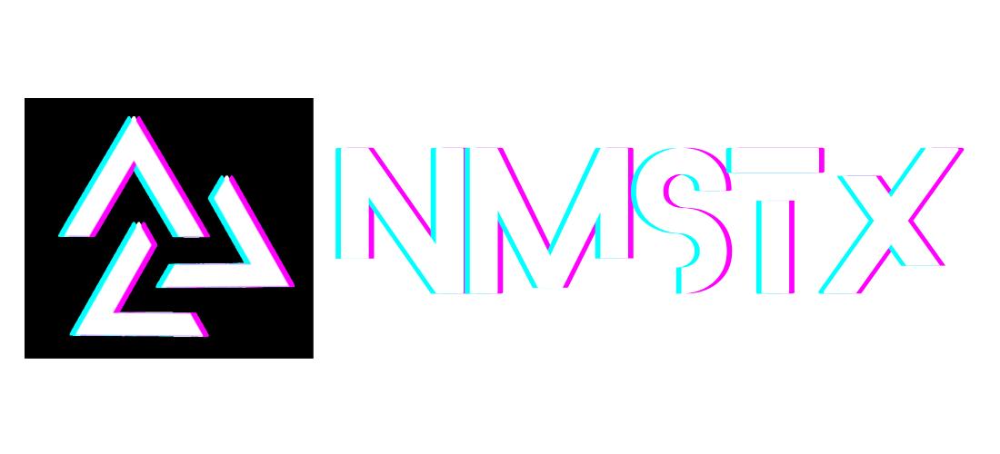
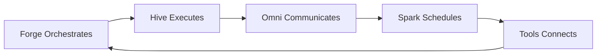

<p align="center">
  
</p>

<h1 align="center">Building the Future of Human-AI Collaboration</h1>

<p align="center">
  <strong>AI that elevates human potential, not replaces it</strong><br>
  Open-source tools for orchestrating intelligent agents and automating complex workflows
</p>

<p align="center">
  <a href="https://discord.gg/automagik">💬 Discord</a> •
  <a href="https://twitter.com/automagikdev">🐦 Twitter</a> •
  <a href="https://namastex.ai">🌐 Website</a>
</p>

---

## 🌟 The Automagik Suite

We're building the complete toolkit for production-ready AI automation. Each product solves a critical piece of the AI development puzzle:

<table>
<tr>
<td width="20%" align="center">
  <br>
  <strong>🔧 Forge</strong><br>
  <sub>AI Orchestration Kanban</sub>
</td>
<td width="80%">
  <strong>Where Vibe Coding Meets Structure</strong><br>
  Multi-agent orchestrator with Git worktree isolation. Experiment with 8+ LLMs (Claude, Gemini, Cursor), compare results, ship code you understand.<br>
  <a href="https://github.com/namastexlabs/automagik-forge">→ Repository</a> •
  <a href="https://forge.automag.ik">Website</a> •
  <a href="https://www.npmjs.com/package/automagik-forge">NPM</a>
</td>
</tr>

<tr>
<td width="20%" align="center">
  <br>
  <strong>🐝 Hive</strong><br>
  <sub>Multi-Agent Factory</sub>
</td>
<td width="80%">
  <strong>Production-Ready AI Teams in 5 Minutes</strong><br>
  YAML-based agent creation with hot-reload, persistent memory, and RAG built-in. One-click install with complete stack included.<br>
  <a href="https://github.com/namastexlabs/automagik-hive">→ Repository</a> •
  <a href="https://hive.automag.ik">Website</a> •
  <a href="https://pypi.org/project/automagik-hive">PyPI</a>
</td>
</tr>

<tr>
<td width="20%" align="center">
  <br>
  <strong>📱 Omni</strong><br>
  <sub>Omnipresent Messaging</sub>
</td>
<td width="80%">
  <strong>One Integration, All Channels</strong><br>
  Multi-tenant messaging hub connecting AI agents to WhatsApp, Discord, Slack, and more. MCP-native with unified API.<br>
  <a href="https://github.com/namastexlabs/automagik-omni">→ Repository</a> •
  <a href="https://omni.automag.ik">Website</a> •
  <a href="https://pypi.org/project/automagik-omni">PyPI</a>
</td>
</tr>

<tr>
<td width="20%" align="center">
  <br>
  <strong>⚡ Spark</strong><br>
  <sub>Temporal Automation</sub>
</td>
<td width="80%">
  <strong>AI That Works While You Sleep</strong><br>
  Cron-based workflow scheduler turning reactive agents into proactive workers. 24/7 autonomous execution with monitoring.<br>
  <a href="https://github.com/namastexlabs/automagik-spark">→ Repository</a> •
  <a href="https://spark.automag.ik">Website</a> •
  <a href="https://pypi.org/project/automagik-spark">PyPI</a>
</td>
</tr>

<tr>
<td width="20%" align="center">
  <br>
  <strong>🛠️ Tools</strong><br>
  <sub>Instant MCP Generator</sub>
</td>
<td width="80%">
  <strong>From API to AI in 30 Seconds</strong><br>
  Auto-generate MCP tools from OpenAPI specs. 9 native integrations, deploy via uvx. Connect any API to any AI instantly.<br>
  <a href="https://github.com/namastexlabs/automagik-tools">→ Repository</a> •
  <a href="https://tools.automag.ik">Website</a> •
  <a href="https://pypi.org/project/automagik-tools">PyPI</a>
</td>
</tr>
</table>

---

## 🎯 Why Automagik?

### The Problem We're Solving

AI development today is fragmented and complex:
- **Lost in chat histories** - No persistent task management
- **Vendor lock-in** - Stuck with one AI provider
- **Production barriers** - Weeks to deploy simple agents
- **Manual everything** - AI that only responds, never acts
- **Integration hell** - Every API requires custom code

### Our Solution

**Complete automation toolkit** that works together:



- **Forge** manages your AI development workflow with persistent Kanban
- **Hive** provides production-ready multi-agent teams in minutes
- **Omni** connects agents to real-world messaging platforms
- **Spark** makes agents proactive with scheduled automation
- **Tools** instantly connects any API to any AI via MCP

---

## 🚀 Quick Start

### Try Individual Products

Each product works standalone - start with what you need:

```bash
# Forge: AI Development Orchestration
npx automagik-forge

# Hive: Multi-Agent Platform
pip install automagik-hive
automagik-hive init

# Omni: Messaging Hub
pip install automagik-omni
automagik-omni start

# Spark: Workflow Automation
pip install automagik-spark
automagik-spark init

# Tools: MCP Generator
uvx automagik-tools
```

### Full Suite Setup

Want the complete experience? Install everything:

```bash
git clone https://github.com/namastexlabs/automagik
cd automagik
make install
make dev
```

---

## 🌍 Who Uses Automagik?

### Developers
Transform from "AI user" to "AI orchestrator" - maintain control while leveraging multiple agents

### Startups
Ship AI features 10x faster without vendor lock-in or massive infrastructure investment

### Enterprises
Production-ready agent systems with security, compliance, and full ownership

### Agencies
Deliver client projects faster with reusable agent templates and workflows

---

## 📚 Learning Resources

- **Documentation**: Each repo has comprehensive docs
- **Examples**: Real-world templates and patterns in each project
- **Community**: Join our [Discord](https://discord.gg/automagik) for help and discussion
- **DeepWiki**: Ask questions about any repo at [deepwiki.com/namastexlabs](https://deepwiki.com/namastexlabs)

---

## 🤝 Contributing

We believe in building together. Each product welcomes contributions:

1. **Explore** - Check individual repo READMEs and issues
2. **Discuss** - Open an issue before starting major work
3. **Build** - Follow project-specific contribution guidelines
4. **Share** - Submit PRs with clear descriptions

See [CONTRIBUTING.md](https://github.com/namastexlabs/.github/blob/main/CONTRIBUTING.md) for detailed guidelines.

---

## 💡 Philosophy

### Human-Centered AI

We believe AI should **amplify human capability**, not replace it. Our tools keep humans in control:

- **You orchestrate** - AI executes
- **You decide** - AI suggests
- **You understand** - AI explains
- **You own** - No vendor lock-in

### Open Source by Design

Everything we build is:
- ✅ **100% Open Source** - MIT licensed
- ✅ **Self-Hostable** - Run on your infrastructure
- ✅ **Privacy-First** - Your data stays yours
- ✅ **Community-Driven** - Built with and for developers

---

## 📊 By The Numbers

- 🎯 **5 Products** - Complete automation toolkit
- 🌟 **5000+** - Combined installations across suite
- 🚀 **10x** - Average velocity improvement
- 🔓 **100%** - Open source, no vendor lock-in
- 🌍 **Global** - Community across 40+ countries

---

## 🔗 Connect With Us

<p align="center">
  <a href="https://discord.gg/automagik">
    
  </a>
  <a href="https://twitter.com/automagikdev">
    
  </a>
  <a href="https://namastex.ai">
    
  </a>
</p>

<p align="center">
  <strong>Star our repos</strong> to show support and stay updated!
</p>

---

<p align="center">
  <sub>Made with ❤️ by <a href="https://namastex.ai">Namastex Labs</a></sub><br>
  <sub><em>AI that elevates human potential, not replaces it</em></sub>
</p>