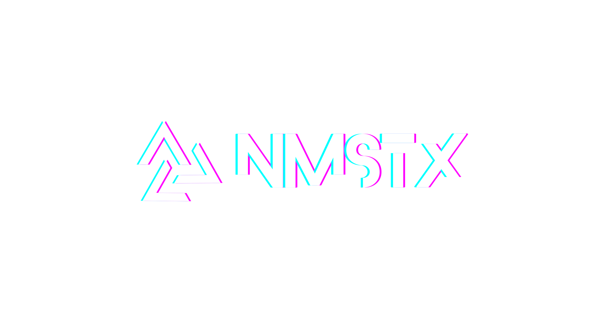

  

<h3 align="center">AI Research & Development Laboratory</h3>

  Generative AI specialists building agent-first infrastructure. 
  The Human Maestro & The AI Orchestra — we amplify, not replace.

  <a href="https://namastex.ai">namastex.ai</a> · <a href="https://discord.gg/xcW8c7fF3R">Discord</a> · <a href="https://www.linkedin.com/company/namastexlabs">LinkedIn</a>

---

### What we build

We research and ship CLI-first AI tools, self-hosted infrastructure, and agent orchestration systems. Our philosophy: filesystem-based agents, self-hosting over cloud, don't get attached to code.

**Core platform** — [automagik-dev](https://github.com/automagik-dev)

| Project | What |
|---------|------|
| [**Genie**](https://github.com/automagik-dev/genie) | CLI agent orchestrator. Wishes in, PRs out. Parallel agents in isolated worktrees. |
| [**Omni**](https://github.com/automagik-dev/omni) | Universal omnichannel for AI agents. WhatsApp, Discord, Telegram, Slack — one API. |
| [**Workit**](https://github.com/automagik-dev/workit) | Google Workspace CLI for AI agents. Headless OAuth, Drive sync. |

**Infrastructure & tools**

| Project | What |
|---------|------|
| [**pgserve**](https://github.com/namastexlabs/pgserve) | Embedded PostgreSQL 18. Faster than Postgres itself. pgvector built-in. `npx pgserve` |
| [**Murmurai**](https://github.com/namastexlabs/murmurai) | Self-hosted GPU transcription. Speaker diarization. Free forever. `uvx murmurai` |

**Research**

| Project | What |
|---------|------|
| [**RLM Explained**](https://github.com/namastexlabs/rlm-explained) | Interactive Recursive Language Models visualizer |
| [**AG-UI Benchmark**](https://github.com/namastexlabs/agui-benchmark) | 26 agent frameworks benchmarked on the AG-UI protocol |

---

### What we believe

- **Agent-first** — agents are the primary workers, humans are maestros
- **CLI-first** — every integration becomes CLI commands, not UIs
- **Self-hosted** — your data, your infrastructure, your control
- **Open source core** — community builds trust, enterprise deploys
- **Ship fast, retire faster** — we've deprecated more products than most companies ship (see [retired projects](https://github.com/namastex888))

---

### Enterprise

We deploy AI systems inside client infrastructure — Azure, on-prem, air-gapped. SSH-key protected, GDPR-compliant, token-metered.

Trusted by enterprise clients in healthcare, finance, agriculture, and education.

  <a href="mailto:felipe@namastex.ai">felipe@namastex.ai</a> · <a href="https://namastex.ai">namastex.ai</a>

