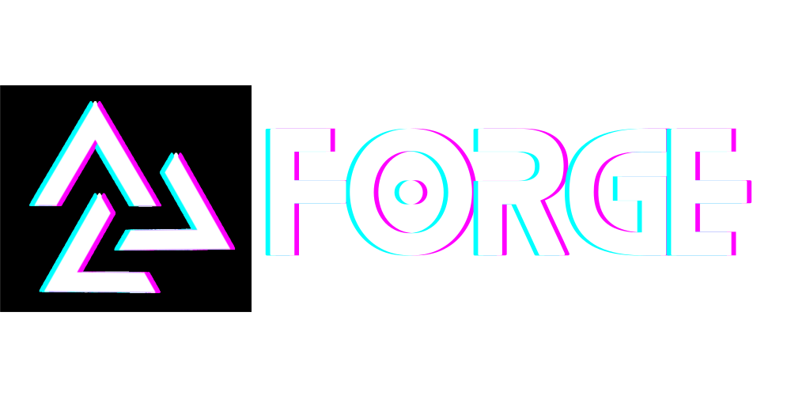
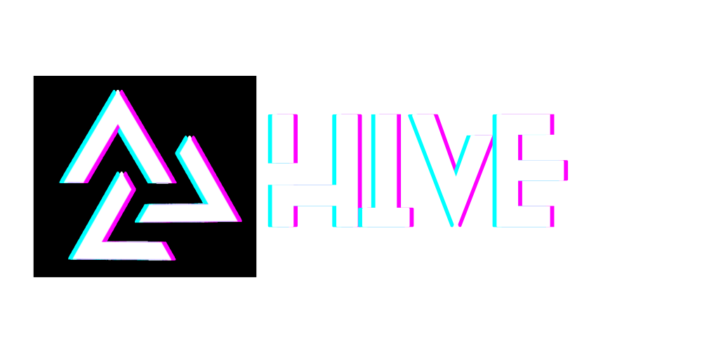
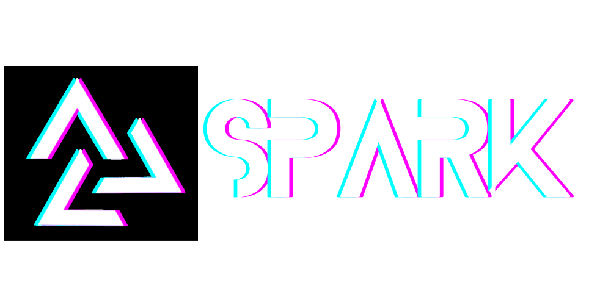
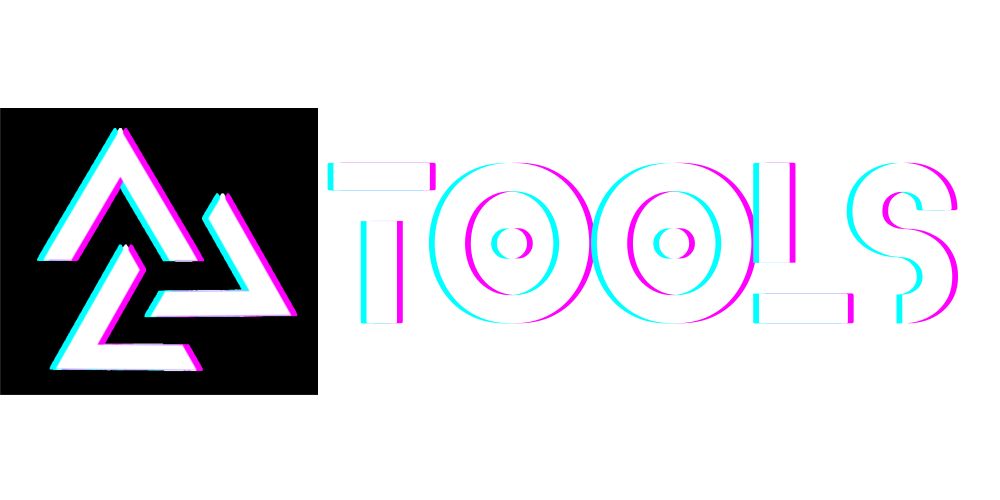
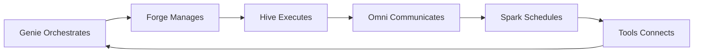

  

<h1 align="center">Building the Future of Human-AI Collaboration</h1>

  <strong>AI that elevates human potential, not replaces it</strong> 
  Open-source tools for orchestrating intelligent agents and automating complex workflows

  
  
  
  
  

  

---

## 🌟 The Automagik Suite

We're building the complete toolkit for production-ready AI automation. Each product solves a critical piece of the AI development puzzle:

<table>
<tr>
<td width="20%" align="center">
   
  <strong>🔧 Forge</strong> 
  AI Orchestration Kanban
</td>
<td width="80%">
  <strong>Where Vibe Coding Meets Structure</strong> 
  Multi-agent orchestrator with Git worktree isolation. Experiment with 8+ LLMs (Claude, Gemini, Cursor), compare results, ship code you understand. 
  <a href="https://github.com/namastexlabs/automagik-forge">→ Repository</a> •
  <a href="https://www.npmjs.com/package/automagik-forge">NPM</a>
</td>
</tr>

<tr>
<td width="20%" align="center">
   
  <strong>🐝 Hive</strong> 
  Multi-Agent Factory
</td>
<td width="80%">
  <strong>Production-Ready AI Teams in 5 Minutes</strong> 
  YAML-based agent creation with hot-reload, persistent memory, and RAG built-in. One-click install with complete stack included. 
  <a href="https://github.com/namastexlabs/automagik-hive">→ Repository</a> •
  <a href="https://pypi.org/project/automagik-hive">PyPI</a>
</td>
</tr>

<tr>
<td width="20%" align="center">
   
  <strong>📱 Omni</strong> 
  Omnipresent Messaging
</td>
<td width="80%">
  <strong>One Integration, All Channels</strong> 
  Multi-tenant messaging hub connecting AI agents to WhatsApp, Discord, Slack, and more. MCP-native with unified API. 
  <a href="https://github.com/namastexlabs/automagik-omni">→ Repository</a> •
  <a href="https://pypi.org/project/automagik-omni">PyPI</a>
</td>
</tr>

<tr>
<td width="20%" align="center">
   
  <strong>⚡ Spark</strong> 
  Temporal Automation
</td>
<td width="80%">
  <strong>AI That Works While You Sleep</strong> 
  Cron-based workflow scheduler turning reactive agents into proactive workers. 24/7 autonomous execution with monitoring. 
  <a href="https://github.com/namastexlabs/automagik-spark">→ Repository</a> •
  <a href="https://pypi.org/project/automagik-spark">PyPI</a>
</td>
</tr>

<tr>
<td width="20%" align="center">
   
  <strong>🧠Genie</strong> 
  Universal AI Companion
</td>
<td width="80%">
  <strong>The Glue Between AI Agents and Repositories</strong> 
  Ships ready-to-run AI workspace in minutes, keeps templates in sync, exposes battle-tested CLI + MCP server for any agent to work with context. 
  <a href="https://github.com/namastexlabs/automagik-genie">→ Repository</a> •
  <a href="https://www.npmjs.com/package/automagik-genie">NPM</a>
</td>
</tr>

<tr>
<td width="20%" align="center">
   
  <strong>🛠️ Tools</strong> 
  Instant MCP Generator
</td>
<td width="80%">
  <strong>From API to AI in 30 Seconds</strong> 
  Auto-generate MCP tools from OpenAPI specs. 9 native integrations, deploy via uvx. Connect any API to any AI instantly. 
  <a href="https://github.com/namastexlabs/automagik-tools">→ Repository</a> •
  <a href="https://pypi.org/project/automagik-tools">PyPI</a>
</td>
</tr>
</table>

---

## 🎯 Why Automagik?

### The Problem We're Solving

AI development today is fragmented and complex:
- **Lost in chat histories** - No persistent task management
- **Vendor lock-in** - Stuck with one AI provider
- **Production barriers** - Weeks to deploy simple agents
- **Manual everything** - AI that only responds, never acts
- **Integration hell** - Every API requires custom code

### Our Solution

**Complete automation toolkit** that works together:

- **Genie** orchestrates AI agents across any codebase with ready-to-run workspace
- **Forge** manages your AI development workflow with persistent Kanban
- **Hive** provides production-ready multi-agent teams in minutes
- **Omni** connects agents to real-world messaging platforms
- **Spark** makes agents proactive with scheduled automation
- **Tools** instantly connects any API to any AI via MCP

---

## 💡 Philosophy

### Human-Centered AI

We believe AI should **amplify human capability**, not replace it. Our tools keep humans in control:

- **You orchestrate** - AI executes
- **You decide** - AI suggests
- **You understand** - AI explains
- **You own** - No vendor lock-in

### Open Source by Design

Everything we build is:
- ✅ **100% Open Source** - MIT licensed
- ✅ **Self-Hostable** - Run on your infrastructure
- ✅ **Privacy-First** - Your data stays yours
- ✅ **Community-Driven** - Built with and for developers

---

## 🔗 Connect With Us

  
  

  <strong>Star our repos</strong> to show support and stay updated!

---

  Made with ❤️ by <a href="https://namastex.ai">Namastex Labs</a> 
  <em>AI that elevates human potential, not replaces it</em>

